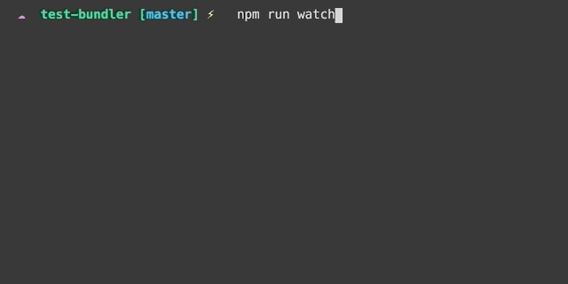

# @drewfle/bundler



Drewfle Bundler is a building and bundling tool for Typescript. It leverages Rollup API and abstracts away common dependencies. It offers out of box Typescript support for building libraries. It also supports bundling front end web apps with PostCSS and additional Babel options.

Under the hood Drewfle Bundler uses [rollup-plugin-typescript2](https://www.npmjs.com/package/rollup-plugin-typescript2). In the future it'll add options to load a much faster compiler and bundle web apps without Babel.

## Options

```
$ drewfle-bundler rollup -h

Usage: cli rollup [options]

Options:
  -o, --output <type>  Build output. Available values are lib-es, lib-cjs, and browser.
    lib-es: equivalent to passing -f es -es.
    lib-cjs: equivalent to passing -f cjs -es.
    browser: equivalent to passing -f iife -s -b browser. (default: "lib-es")
  -f, --format <type>  Output module format. Available values are amd, cjs, es, iife, system, and umd
  --src <path>         Source file path (default: "src/index.ts")
  --dist <path>        Dist file path (default: "dist/bundle.js")
  --watch              Enable watch mode (default: false)
  --serve              Enable server (default: false)
  -p, --port <port>    Specify dev server port (default: "8080")
  -b, --babel <mode>   Enable babel. Available options are node and browser
  -e, --external       Enable external to exclude specified dependencies. By default it excludes all dependencies. (default: false)
  -s, --source-map     Enable source map (default: false)
  -t, --terser         Enable terser (default: false)
  -h, --help           display help for command
```

### Minimal React Project Setup

It needs at least:

```sh
src/ # source folder and entry file names are customizable
  index.tsx
package.json
tsconfig.json
```

Outputs like:

```sh
dist/ # output folder and bundle names are customizable
  types/
  bundle.css
  bundle.js
  bundle.js.map
  index.html
```

#### Sample `package.json`

```json
  "scripts": {
    "build": "drewfle-bundler rollup --src src/index.tsx --dist dist/bundle.js -o browser",
    "watch": "drewfle-bundler rollup --src src/index.tsx --dist dist/bundle.js -o browser --watch --serve",
  },
  "dependencies": {
    "react": "16.13.1",
    "react-dom": "16.13.1"
  },
  "devDependencies": {
    "@drewfle/bundler": "^1.0.0",
    "@drewfle/config": "^0.1.0",
    "@types/react": "16.8.24",
    "@types/react-dom": "16.9.8",
    "typescript": "3.9.6"
  }
```

#### `tsconfig.json`

```json
{
  "extends": "@drewfle/config/typescript/tsconfig-base.json"
}
```
